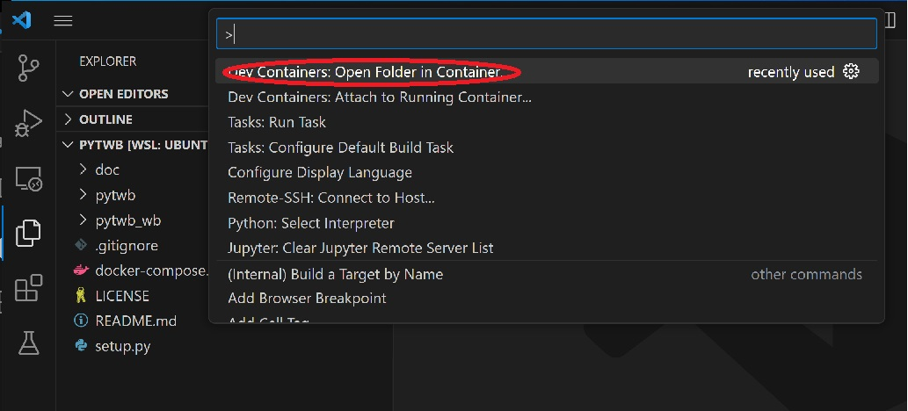
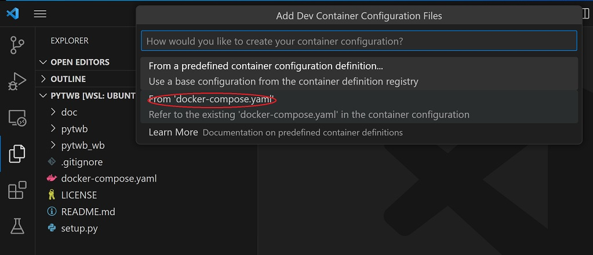

# pytwb: A workbench for creating ROS applications based on py_trees and py_trees_ros frameworks (beta).
pytwb is assumed to be used with VSCode under docker environment. It generates and runs ROS packages on a command line basis. Although based on py_trees, it is possible to define behavior trees using XML, because pytwb is equipped with the XML parser.  With just writing XML and Python codes by VSCode, it becomes possible to execute them interactively as a ROS application.

## Getting Started
### Prerequirement
pytwb is a normal Python application and can be installed locally, but it is recommended to use docker to build ROS applications and create an execution environment by using pytwb. Development is done by first generating a docker under the control of VSCode. Therefore, the docker environment and VSCode must be available for the Ubuntu-22 environment. It's standard to do the development in WSL. VSCode must have a plugin installed for docker.

### Installation
The entire installation process is managed by VSCode and you don't need to build explicitly.
First, you need to retrieve the pytwb module.

```
git clone https://github.com/momoiorg-repository/pytwb.git
cd pytwb
```
(at "pytwb" directory)  
start VSCode by "code ."  
press “F1”  
 -> select “Dev Containers: Open Folder in Container” tab  
  
 -> select current directory as work directory  
 -> select “From ‘docker-compose.yaml’  
  
the corresponding docker will be started and VSCode is attached automatically.  
Set working directory of VSCode by its "Open Folder" menu to “/root/pytwb_ws”  (1st time only. Automatically set after creating a package).  
Install VSCode "Python in Dev Container" plugin (1st time only).  
Select “main.py” and press F5.  
The “> “ prompt will be displayed in the Terminal section.   This implies that pytwb command session has been started successfully.  
The command input  

\> help

gives you the available command description.  
And by inputting

\> create sample

the “sample” package will be created.

### Coding and running
You need to input behavior code in Python and behavior tree code in XML by using VSCode.    
First, create the behavior code in Python under  
```
 /root/pytwb_wb/src/sample/sample/behavior  
```
and create the XML code of the behavior tree under  
```
/root/pytwb_wb/src/sample/sample/trees
```

When all codes are completed, input  
\> run \<tree name\>  
from the pytwb command session and the behavior tree based application will get running under the VSCode debug mode.
The \<tree name\> is the file name of the XML behavior tree you created under the 'trees' directory, or it without the '.XML'.

You can set break points to any locations of the Python code you created.

When you need external program modules, you can execute apt and pip3 commands from the pytwb prompt.  The installation of these modules will be recorded and reflected to Dockerfile template automatically.  The template will be generated by “dockerfile” command, and the _Dokerfile file will be placed at right under the pytwb_wb directory as the Dockerfile draft.

Finally, the package is completed by building a ROS package with  
\<package name\>/\<package name\>/main.py  
as the main.

### Create git repository
You can create a new git repository based on the editing contents at any timing of the development.  After creating, you need to switch the development base to it with starting a new docker in the same way as the original pytwb repository.  This repository migration work should be done without running docker, and you need to create a vacant repository first.  Copy the contents under the pytwb_ws directory and docker-compole.yaml to new repository.  ‘ship’ script does the work.  Edit docker-compose.yaml properly after copying it.  In particular, the ‘image’ tag value should be modified.  Create Dockerfile under the pytwb_ws directory from _Dockerfile which was created by pytwb (and create README.md and LICENSE if needed.)

## Document
- [overview](doc/overview.md)
## Sample code
- [pytwb_demo](https://github.com/momoiorg-repository/pytwb_demo)
